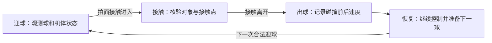

# 击球动作分析：文献与源码核查、实测待补

2026-09-20。本文是计划 4.1a 的准备产物，尚未重放 checkpoint，不能当作动作验收结果。

## 已核实的来源

JuggleRL 论文图 7 描述策略对小偏差直接修正、对大偏差先稳定再逐步修正；这是学习行为的分析，不是人工两阶段控制器。其策略输出 CTBR，通过低层控制器执行。[论文行为分析](https://arxiv.org/html/2509.24892v2)

HCSP 的主仿真实验使用 50 Hz PRT。附录 B.3 和图 9 描述 Attack/Attack_hover 衔接学习中出现的前空翻扣球；AeroWall 尚未重放此动作，也不能据此推断 CTBR 必然具有相同可达性。[论文 2.1、3.1、B.3](https://arxiv.org/html/2505.04317v5)

固定源码版本见 `upstream-lock.json`，以下路径均相对对应上游仓库。

### JuggleRL 的实际动作链

`scripts/train.py:PIDrate_FM` → `utils/torchrl/transforms.py:PIDRateController_flightmare` → `controllers/lee_position_controller.py:PID_controller_flightmare` → `robots/drone/multirotor.py:apply_action`。

- 原始动作经过 tanh，前三维乘 π 得到目标机体角速度（rad/s）。
- 第四维映射到 [0, 15]；控制器将它乘质量生成 `force_des`，因此其物理量是推力加速度（m/s²），不能标成牛顿或 PWM。
- 控制器使用机体状态分配旋翼推力，逐旋翼裁剪到 [0, max_thrust]，再映射为 [-1, 1] 的旋翼命令。
- 记录原始策略动作、tanh 后动作、目标角速度/推力加速度、裁剪前后旋翼推力，分别统计饱和。
- 当前上游会将控制器 NaN 转为零；验证时必须在这个处理之前捕获数值异常，不能因最终动作有限就宣布训练稳定。
- 上游评测函数强制开启渲染，训练结尾也调用评测。若 A100 训练可用而渲染失败，需要独立的无渲染重载评测入口，记录为项目改动。

### HCSP 的技能衔接核查

| 技能 | 静态源码入口 | 需要补充的实测 |
|---|---|---|
| Receive / Receive_hover | `hcsp/envs/low_level_skill/Receive.py`、`Receive_hover.py` | 迎球方向、拍心接触、击后状态与恢复 |
| Pass / Pass_hover | `Pass.py`、`Pass_hover.py` | 向队友送球的法向与接触点速度 |
| Set / Set_hover | 对应 set 技能环境与 `scripts/train_set_hover.py` | 托球出射角、最高点、恢复 |
| Attack / Attack_hover | `Attack.py`、`Attack_hover.py`、`scripts/train_attack_hover.py` | 翻转、撞击速度及击后恢复是否连续 |

Attack 的源码奖励区分当前击球阶段和击球后阶段；当前阶段约束 roll/yaw，击后考虑出球方向。Attack_hover 的奖励有目标位置、朝上方向及角速度项。`train_attack_hover.py` 分别加载已有技能和恢复技能的 checkpoint，显示恢复训练依赖前序实际技能状态。这里仅核实结构，尚未验证某个公开 checkpoint 的质量或一致性。

## 四阶段测量图（本项目测量设计，非实测轨迹）

阶段边界由实际接触进入/离开和后续控制状态标记，不以固定冷却步数推断成功。没有合法拍面接触时，不生成接触成功记录。连续视频展示保留整个迎球—恢复过程。

每个事件关联 run ID、checkpoint 哈希、场景 ID、seed、env/episode ID、物理步号、策略步号和仿真时间。必须同时记录事件前后最近的物理采样，不能用策略帧差直接冒充瞬时碰撞前后速度。

| 量 | 单位 / 约定 | 核验要点 |
|---|---|---|
| 拍面法向 | 世界坐标单位向量 | 来自真实碰撞拍面局部法向及姿态变换 |
| 机体角速度 | rad/s，注明 body/world | 统一坐标后再求接触点速度 |
| 接触点 | 世界坐标 m，另存拍面局部坐标 | 属于拍面碰撞体；不是球心或机体原点 |
| 机体质心 | 世界坐标 m | 取实际刚体 COM，不假定等于根节点位置 |
| 球速 | m/s，世界坐标 | 分别保存接触前后及采样时间 |
| 拍面接触点速度 | m/s，世界坐标 | `v_com_w + omega_w × (p_contact_w - p_com_w)` |
| 恢复耗时 | s | 事件离开至冻结的目标条件恢复判据；失败记删失与原因 |

刚性固定拍面随机体转动。“水平安装”只限定机体坐标下安装姿态，不表示世界中永远水平。几何法向和碰撞对法向需区分，避免法向符号随物理接触对象顺序翻转。

## AeroWall 的约束与尚未验证的设计

- 垫球基线使用上游位置/高度设置；壁球任务改为目标条件准备与恢复，不设置全程小倾角或翻转即失败。
- 第一版仍为单个带阶段输入的 CTBR 策略。学习课程使用真实击球后状态，不把 HCSP 的不同 PRT checkpoint 接到 CTBR 控制器上。
- 先验证倾斜拍面向前上方送球并接回。更大姿态可由策略探索；前空翻不是预设轨迹或必须展示的动作。
- 恢复判据的距离、速度、姿态容差及持续时间须在开发集上依据可达性冻结。当前不预先设定会压制必要机动的姿态阈值。
- 恢复统计同时给出失败/超时数量。只有顺利接回的片段不能证明完整恢复能力。

## 必须补齐后才可通过 4.1a

1. 指定可运行 checkpoint、解析配置、代码版本和轨迹文件。
2. 绘制来自同一真实连续回合的四阶段图，叠加法向、角速度、接触点与球速。
3. 导出接触点平移/转动速度贡献，验证坐标系和 COM 定义。
4. 对正常垫球、偏球救回、单次击墙接回分别统计恢复耗时与失败。
5. 区分论文描述、源码证据、AeroWall 实测和设计推断；当前本文只有前两类证据和测量设计。

## Early real-policy evidence (not completion of the action-analysis gate)

The 3,276,800-transition SingleJuggle checkpoint has been replayed on 100 fixed development scenarios (runs/singlejuggle-eval-003.json, raw events and NPZ beside it). None reaches five cap impacts. artifacts/early-policy-trajectory-v2.png/.json selects the upper-median episode by duration (scenario 84), not a best clip. Its first real cap impulse occurs at 0.42 s, ball vertical velocity changes from -3.924 to +3.510 m/s; it reaches the post-hit apex near 0.78 s and fails with the ball too low at 1.34 s. No successful recovery time is established. The exported contact-point velocity includes translational and rotational contributions.

The diagram's windows are analyst-defined approach/contact/outgoing-to-apex/recovery observation, not a hand-coded policy. Further learned-policy improvement and HCSP skill replay remain necessary before WallRally reward/attitude decisions. Original body collision flags and visual/collider geometry mismatch are documented separately; no assumption of a 20 cm physical bat radius is justified.

## Verified 13.1-million-transition juggling and HCSP reference replay

The unchanged 13,107,200-transition checkpoint achieves at least five positive cap-impact credits in 95/100 of the frozen seed-20260921 development scenarios (runs/singlejuggle-eval-004.json). Those 95 episodes reach the 500-step/10-second time limit with 15–16 impacts. The report's legacy reason string says upstream_termination even on these truncations; its stats.truncated correctly records 1. The evaluator now labels future timeout outcomes separately, and analysis uses the actual truncation flag. This is one training seed and a development set, not the formal wall-task comparison.

artifacts/juggle-13m-cycle.png/.json shows the first complete return cycle of median-duration scenario 47. The first-to-second cap impact interval is 0.72 s, or 0.68 s from contact departure to the next impact. Across all completed returns the median interval is 0.64 s (1,382 intervals, range 0.60–0.80 s). These include ball flight and are not a frozen hover-convergence time. Time-censored final cycles and failed episodes are not invented as recovered. The learned CTBR policy remains a single feed-forward policy; plot phases are analytical windows.

HCSP Attack and Attack_hover original Iris/PRT checkpoints run natively in separate processes without updating weights or installing hcsp into the training environment. Attack_hover reference-03 replays the original policy chain on 16 initial scenarios; the upstream Att_hit flag occurs in 3, while valid attacker/base-link GPU contact samples occur in 6. These are different definitions. One scenario has inverted attitude samples, but full front-flip and stable recovery reproduction are not established. The median-duration hit-flag case (scenario 2) has only 0.40 s after the hit flag, minimum target distance 0.923 m, final distance 1.134 m and final speed 0.814 m/s before termination. Receive/Pass, Set and their hover counterparts still need replay.

The HCSP iris_batVisualOnly.usd has a visual bat but physical base/rotor shapes. CPU contact reports and callbacks both produce zero body contact point/impulse fields for this run. Native RigidContactView GPU data reads 15 valid point samples without changing solver parameters; disable_stablization=False is explicitly retained and existing report APIs are prepared before physics initialization. 13 single-contact first-episode samples agree with measured normal ball momentum to within 2.13%; the audit does not claim complete tangential/simultaneous-contact accounting. Source: scripts/probe_hcsp_attack.py, scripts/audit_hcsp_tensor_contacts.py, docs/hcsp-tensor-contact-audit.json.

NVIDIA discussed old GPU-pipeline CPU contact-report limitations in https://forums.developer.nvidia.com/t/contact-report-does-not-make-sense-when-enabling-gpu-pipeline-contact-sensor-ant-example/266782 . This supports checking GPU-native data, but does not by itself prove the exact cause of our scene's zero fields. Future WallRally body/illegal-contact sensing must use validated GPU data where CPU fields are invalid, while retaining pair identity and entered/exited state.

## Set / Receive / Pass reference evidence and final juggling checkpoint

The final 32,768,000-transition checkpoint passes five-cap-impact development scoring in 93/100 frozen scenarios (eval-005); all 93 reach the 10-second limit with 15–16 impacts. It does not improve over the earlier 95/100 checkpoint. Both checkpoints and exact scenario hashes remain recorded.

Set_hover and Receive_hover reproduce the pinned shell configuration with trained skill and hover checkpoints on 16 first episodes each. Their role hit flags appear in 15 and 16 scenarios; GPU positive base-link contacts appear in 14 and 15. Median-duration hit-flag episodes have residual motion: Set scenario 3 ends 0.304 m from target at 1.023 m/s; Receive scenario 6 ends 0.482 m away at 0.668 m/s. The plots show position recovery and oscillation, not a frozen hover-success threshold.

Pass_hover's pinned shell requires unpublished save_state CSV distributions and fails before rollout (runs/hcsp-pass-hover-reference-01.json). The separately labelled --default-pass-state diagnostic uses the upstream built-in reset, retaining original dynamics, policies and PRT actions. In this shifted reset distribution, 5/16 scenarios have both FirstPass hit flags and positive role base-link contacts. Scenario 9 observes 7.2 seconds after the hit flag and ends 0.093 m away at 0.651 m/s. This is not reproduction of the missing trained-state distribution.

scripts/summarize_hcsp_impacts.py exports every active role base-link sample, step-bracketed ball velocities, body COM/angular velocity, and separate translation/rotation contributions to contact-point velocity. These are post-step body samples and discrete-time ball velocity brackets; not instantaneous collision limits or independent physical-bat events.

The Receive normal-momentum audit initially has a 24.02% worst discrepancy. Original pair events identify simultaneous base_link and rotor_3 ball contacts at environment 11 step 86; auditing only the base-link normal impulse is incomplete. The updated audit retains the raw result and separately reports candidates without other known ball pairs. Seven Receive candidates have maximum error 7.61e-7. CPU pair availability and unaccounted tangential impulses remain limits; this filtering is not proof of complete multi-contact force accounting. All raw events remain unchanged.

Remaining 4.1a work: contact-bounded four-phase figures, recovery criterion and censoring analysis, off-center recovery coverage, and the wall-delivery feasibility diagnosis. No global small-tilt restriction, flip failure, or interchangeable PRT/CTBR claim has been introduced.

## Body-enabled geometry and contact-bounded recovery update

Aligned eval-03 replays the same final 32,768,000-frame policy and frozen 100 scenarios with body collisions enabled and the declared +0.028 m collider translation. Only 46/100 reach five legal cap credits; 66 end by ball/body contact, 31 by time limit and 3 by original boundary termination. Raw five ball/bat entries occur in 53%, which is not the legal metric. Drone/ball initial states match exactly; derived bat position differs by at most 1.1921e-7 m. The original 93% baseline cannot be transferred to this geometry.

Lazy contact readback observes current PhysX headers and only reads a GPU buffer if current CPU points are unavailable. Frozen eager/lazy outcomes and all twelve saved trajectory arrays match exactly. The lazy rollout takes 21.506 s with 2,680 GPU buffer reads. Original eager rollout timing was not recorded; no measured wall-clock speedup ratio is claimed. Lazy mode does not scan unmatched stale buffers, and never uses them to create events. See docs/aligned-readback-comparison.json.

Aligned bat paired-freefall reaction probes pass for 16 environments at each dt: relative momentum-balance errors 2.2224e-6 (0.02 s) and 8.2655e-7 (0.01 s). The warmup step makes initial drone velocity differ between those runs: these are two reaction checks, not a strict paired timestep-convergence proof.

Contact-bounded HCSP figures now include first positive signed-coefficient magnitude, matching LOST departure, body normal/angular velocity, contact-point COM/rotation velocity decomposition and recovery censoring. Project diagnostic recovery requires sustained 0.3 s inside distance/speed/angular-speed/up-z thresholds. Nominal thresholds are 0.25 m / 0.5 m/s / 1 rad/s / 0.9; strict 0.1 / 0.25 / 0.5 / 0.98; relaxed 0.5 / 1 / 2 / 0.8. These are sensitivity diagnostics, not paper criteria or frozen WallRally rewards.

Across all 16 scenarios per skill, nominal recovery counts are Set 2, Receive 1, Pass-default 5 and Attack 0; relaxed counts 9, 12, 5 and 0; strict counts all zero. Positive role contacts occur in 14, 15, 5 and 6 respectively. No-contact and censored cases remain in the denominator. Pass-default still uses the disclosed shifted reset distribution because original CSVs are unavailable. See artifacts/hcsp-recovery-analysis-v2/summary.json and the four inspected motion figures. Ball flight and body recovery overlap; no sequential hand controller is inferred.

AlignedJuggle is a development curriculum, not WallRally: original observation and CTBR control, body collisions enabled, legal physical cap reward and illegal-contact termination. It excludes the original velocity-change contact proxy and fixed hit cooldown. Dense shaping rewards horizontal interception/height; the cap reward prefers ballistic apex near 1.7 m. There is no global tilt/flip restriction and no mid-flight state rewrite. Original training frames are retained in transfer budget accounting. Formal method comparisons must include this pretraining cost. Off-center recovery coverage and actual single wall-return feasibility remain open before completing 4.1a.

Baseline initial-offset stratification retains all 100 scenarios. Horizontal ball/drone separation ranges 0.0073–0.1341 m; rank-quartile five-cap counts are 10, 11, 13 and 12 out of 25. All initial ball horizontal velocities are zero. This describes the fixed initial-position distribution; it does not establish perturbation recovery or causal sensitivity. All 22 zero-cap episodes and all failure reasons are retained in docs/aligned-baseline-failure-strata.json.

## Tilted bat delivery diagnosis

`scripts/probe_wall_delivery.py` initializes 16 Air/ball fixtures at 20–50 degree pitch, height 4 m, incoming ball velocity -8 m/s along the bat normal. After initialization, both bodies move solely under PhysX; no policy or state correction operates. At dt=0.02 s, all first impacts include illegal body/non-cap contact and none establishes cap-then-wall. At dt=0.005 s, all 16 show cap-then-wall; 14 record a wall event before drone-ground termination, while two hit the wall only after termination. No completed legal rally or learned recovery occurs. Reports: runs/wall-delivery-fixture-01.json and runs/wall-delivery-fixture-dt005-01.json.

This is strong evidence that fast tilted impacts need additional time-resolution validation. It is not strict timestep convergence: the one-step warmup gives slightly different initial drone velocities/positions. Before freezing WallRally physics, repeat with exactly matched initial state at intermediate dt and preserve policy/control timing independently of physics substeps. The previous slow centered reaction gate cannot support high-speed tilted collision accuracy.
