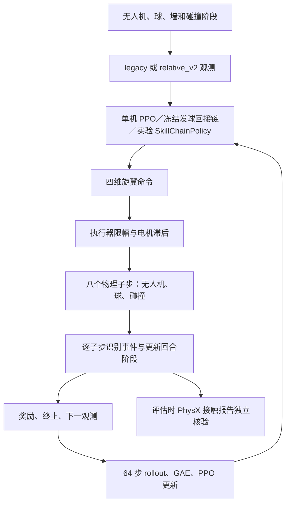

# AeroWall：HCSP 技能升级与能力保持 Implementation Plan

**状态：T0–T5 已执行；多种子与 Recover-Tanh 诊断均未通过 P2。另完成 `AeroWallLaunchInterceptTargetRetentionV1` 无训练消融及分角色、分 phase 失败合成；14 个首次动作分歧前记录状态逐位相同，但回合指标不变、安全失败增加 1；正式 C350 保持，不晋升。**

**确认日期：** 2026-09-24。

**Goal：** 从当前 AeroWall 代码出发，修复技能学习接口与评估契约，逐步学会针对不同来球和墙面目标主动击球，在保持正式 C350 固定投球能力的前提下提高合法回接与连续对墙击球能力。

**Architecture：** 保留 HCSP／IrisTest／50 Hz PRT 主线，复用现有课程、冻结发球回接链和 `aerowall/wall_rl` 模块。先完成接口修复与同权重串联诊断，再训练参数化 Hit 和真实状态串联；高层 RL、共同适应和域随机化按实测门槛触发。

**Tech Stack：** Isaac Sim 2023.1.0-hotfix.1、PhysX、HCSP 固定版本、PyTorch、TorchRL、TensorDict、Hydra／OmegaConf、单机 PPO。

## 执行边界与阅读说明

> 本文是历史研究方案与执行记录。文中关于授权、操作范围或下一步行动的表述仅反映当时记录，不构成当前用户授权；本项目当前操作范围以当前会话的用户请求为准。

- 本文件用于审阅原方案、技术判断和历史结果，不作为当前执行任务清单。
- 该历史计划当时预设的代码修改、测试、训练和评测，不由本文件本身授权；当前项目整理范围见 [项目文件与发布边界](../RELEASE_BOUNDARY.md)。
- 下文的设计目标与验收条件仍是实施标准；是否完成以及具体证据见末尾执行记录和 [`wall-skill-upgrade-v3-execution.md`](../wall-skill-upgrade-v3-execution.md)。
- 优先采用有升级价值且无明显能力退化的方案；没有通过冻结验收的策略保持实验身份，正式 C350 方案继续保留。
- 不重建整个 HCSP，不一次性大规模重构，不把单机共同适应称为 co-self-play。
- 实施时按依赖顺序推进；先证明接口正确，再解释算法效果。训练失败与实现错误必须分别记录。
- 所有仓库相对路径均相对于本仓库根目录；运行环境路径由使用者配置。迁移已核验，主机路径和本地冲突备份不属于分发内容。
- 已有工作区修改是此前实验成果，本计划不授权撤销、覆盖或清理它们；实施开始前记录来源与差异。
- 本轮只读核查覆盖当前主线入口、环境、策略串联、观测／轨迹／奖励／课程模块、评估器、相关测试、历史报告及实际上游控制／PPO 实现；不声称逐行审计仓库所有历史探测脚本。

## Part 1｜当前 RL 系统与数据流

### 1.1 三条路线的边界

| 路线 | 入口、环境与策略 | 定位 |
| --- | --- | --- |
| HCSP／Iris／PRT | `scripts/train_hcsp_wall_rl.py`；`HCSPSingleWallRL`；`MAPPOPolicy`、`ChainedRecoveryPolicy`、实验 `SkillChainPolicy` | 本计划主线，包含正式 C350 方案与新技能实验 |
| JuggleRL／CTBR | `scripts/train_wall_rally.py`；`WallRally → AlignedJuggle`；`WallMAPPOPolicy`／`ReferenceWallPolicy` | 历史实验路线，参考其诊断和审计经验，不直接混入主线 |
| HCSP 多角色单机适配 | `scripts/hcsp_single_wall_env.py`；`HCSPSingleWall`／`SingleBodyRoles` | 早期预训练策略探测，不是当前 C350 训练环境 |

HCSP 实际锁定 commit 为 `009961b8f5702dd0c1c943cef0e01e09dfcd138d`。本次核查确认本地研究副本与 138 实际运行副本的 `mappo.py`、`multirotor.py`、`rotor_group.py` 哈希一致；主线环境和链式策略文件的两端哈希也一致。

### 1.2 仿真与控制

| 项目 | 当前值与实现 |
| --- | --- |
| 仿真器 | Isaac Sim 2023.1.0-hotfix.1，PhysX 刚体接触 |
| 无人机 | IrisTest，单架 |
| 球 | 半径 0.1 m，质量 0.005 kg |
| 墙 | 有限实体，厚 0.2 m、宽 6 m、高 8 m；中心 x=0，正面 x=0.1 |
| 球心碰墙预测平面 | 当前常用 x=0.2，即墙正面加球半径 |
| 物理步长 | `cfg.sim.dt=0.0025`，400 Hz |
| 控制频率 | `cfg.sim.substeps=8`，0.02 s／50 Hz |
| 电机处理 | 每控制步更新一次电机滞后；余下七个子步保持对应推力 |
| 并行环境 | 支持；训练 CLI 默认 64，近期实验 128 |
| 默认时限 | 600 控制步，即 12 s；演示另用较长时限 |
| 默认配置 | `wall_observation_version=legacy`、`wall_reward_design=legacy`、`wall_case_mode=fixed` |



动作不是以牛顿为单位直接输出的四个推力。`MultirotorBase.apply_action()` 调用 `RotorGroup.forward()`，将命令映射为 `sqrt(clamp((a+1)/2,0,1))` 形式的目标 throttle，经过电机滞后后产生推力和力矩。默认高斯分布不限制采样范围，实际执行器会限幅；分析时需区分原始动作与实际执行命令。

### 1.3 Observation

主入口是 `HCSPSingleWallRL._compute_state_and_obs()`：

- `A0/A1/A2` 为 26 维，保留 HCSP GoTo 前缀。
- `legacy` 为 46 维：GoTo 前缀 26，加球位置 3、相对位置 3、球速度 3、阶段 3、预测量 4、上一动作 4。
- `relative_v2` 也是 46 维：保留 GoTo 风格前缀，追加机体系相对球位置／速度、相对截点、阶段、墙目标、飞行时间、可行标记和上一动作。
- `relative_v2` 环境还输出 `legacy_observation`，供旧技能使用。
- 前缀中的目标可以变化；相同观测维度不意味着语义兼容，不能依靠张量形状判断检查点可互换。

坐标系来源必须由上游 `MultirotorBase.get_state()` 核验：位置为环境局部位置；`root[...,7:10]` 是世界轴方向线速度，不是机体系线速度。

### 1.4 PPO

| 配置 | 当前实际值 |
| --- | --- |
| Actor／Critic | MLP `[256,128,128]`，ELU、LayerNorm |
| 46 维输入适配 | `SplitLayerNorm` 分别处理前 26 维和后 20 维 |
| 动作分布 | 对角高斯；新建 `log_std=0`，标准差 1；载入检查点后以权重为准 |
| Actor LR | 默认 `1e-4` |
| Critic LR | `5e-4` |
| `gamma`／GAE λ | `0.995`／`0.95` |
| PPO clip／entropy coefficient | `0.1`／`0.001` |
| Rollout | 每环境 64 控制步，1.28 s |
| Minibatches／epochs | 16／4 |
| 梯度限幅 | `max_grad_norm=10.0` |
| 归一化 | 优势归一化、Critic ValueNorm；不是直接归一化每步任务奖励 |
| Critic 输入 | `critic_input=obs`，当前主线不是特权 Critic |

128 环境时每批 8,192 个控制步样本，划分前每 minibatch 为 512；技能掩码后实际可训练样本更少。`SkillChainPolicy.update_actor()` 还对选中样本的优势重归一化。首轮不盲目改 PPO 参数，先测有效技能样本、ratio、梯度、动作限幅和奖励分量。

上游 GAE 使用 `done` 阻断 bootstrap，没有直接区分任务终止与时间截断；需在训练契约中明确时限是任务终点还是采样截断。任何改动必须单列版本，不悄悄改变 C350 基线。

### 1.5 Reset、事件和 termination

- `_reset_idx(env_ids)` 当前正式初态：无人机 `[1.5,0,2.0]`，球 `[1.5,0,4.8]`；无人机单位姿态、零速度。
- `train` 模式新增球位置／速度、无人机水平位置与墙目标随机化；并非完整的姿态、动力学随机化。
- Hit 训练支持人工近接触与前序策略运行混合；正式整链评估从完整初态开始。
- `_observe_substep()` 使用球速度变化、位置与拍面几何识别事件；评估器再以 PhysX 接触报告核验。因此不能把训练检测器直接描述为完全由 PhysX 回调驱动。
- 球触地／越界、无人机触地／接近墙面、非法接触构成主要训练终止；`A1/A2/INTERCEPT` 在接触成功结束，`WALL` 在碰墙结束，`RETURN` 在首次回接结束。
- `wall_end_on_ball_drop` 是演示用途的不同终止协议，不能与严格训练安全终止混作同一评估。

## Part 2｜问题、证据与修复优先级

| 问题 | 具体依据和影响 | 优先级 |
| --- | --- | --- |
| 相对速度混用坐标系 | `build_relative_observation()` 把球速度旋转到机体系，却减去世界系 `root[...,7:10]`。正确形式为 `Rᵀ(v_ball-v_drone)` | P0 |
| legacy 技能采样／PPO 输入不一致 | `SkillChainPolicy.__call__()` 使用 legacy 输入生成动作后恢复公共输入；`update_actor()` 未恢复该技能的实际输入。训练时重算 log-prob 可能基于另一个观测 | P0 |
| 读取观测推进 FSM | `_compute_state_and_obs()` 修改 `skill_id` 和 `skill_held_steps`；上游局部 reset 重算全批观测，可能推进未重置环境 | P0 |
| 奖励阶段归属滞后一拍 | `_step()` 先更新下一观测及 FSM，再计算奖励；`approach_mask` 可能依据下一执行者 | P0 |
| 正式基线组合不统一 | 正式 C350 是冻结发球＋C350 回接；最近 `C350 direct` 仅运行回接 actor，不能作为完整正式方案的唯一基线 | P0 |
| 预测把有限墙当无限平面 | `predict_intercept_batch()` 只依据越过 x 平面反射，没有检查该时刻 y/z 是否在墙体内 | P1 |
| 几何可行性被过度解读 | `distance <= 0.35 + 2t` 未包含姿态、速度、电机响应，不能保证策略真实可接 | P1 |
| 人工 Hit 训练所有权不稳定 | 人工接触时间 0.35–0.45 s，默认 Hit 窗口 0.18 s，短暂驻留后可回到 Intercept | P1 |
| 势函数边界不完整 | 预测无效时直接把势函数设为零，可能产生局部正奖励；阶段／终止边界未完整定义 | P1 |
| 预算与恢复支持不统一 | 完整优化器保存、定期保存、预算停止主要在旧 `experiment` 路径；通用技能路径未完整复用 | P1 |

观测错误的最低测试例：无人机和球都以世界系 `[1,0,0]` 运动，无论无人机偏航角如何，相对速度都应为零。当前测试主要使用单位姿态与零速度，无法覆盖该错误。

这些问题不证明既有所有失败都由代码造成。特别是 legacy 技能训练输入问题不影响仅推理的 C350 兼容性实验。修复后也不能追溯宣称旧候选已通过验收；必须重新做对应版本实验。

### 2.1 已有结果与解释边界

- 固定 128 环境测试：完整发球＋C350 链在 12 s 窗口内平均居中前缀 8.0 轮，未记录安全失败。
- 动态 Intercept＋C350 Hit／Recover 在 v4 未见来球上：102/128 合法首击，4/128 合法第二击，1/128 至少三回合，65/128 安全失败。
- 同一实验链固定投球：平均 4.0 轮，113 次无人机墙面失败、15 次非法接触失败，未通过能力保持门槛。
- 新 Hit、`causal_v1/v2`、扩大 Hit 窗口的候选均未晋升；没有完成有效的三种子正式优越性验证。
- 最终演示的 25 轮来自更长时间回放；不能与默认 12 s 的 8.0 轮直接比较，也不是跨种子可靠性证明。
- `rallies` 统计回接次数：首击不计为一次回接。`rallies>=3` 通常需要至少四次合法拍面接触，不等于“三次击球”。

已有结果见 `docs/wall-skill-v2-protocol.md`、`artifacts/wall-skill-v2/` 和 `docs/demo-acceptance-2026-09-23.md`。

## Part 3｜HCSP 迁移边界

HCSP 的低层技能、真实前序状态串联、事件驱动组合及后期共同适应值得借鉴；3v3 对抗与团队机制不适合直接复制到当前单机任务。

| HCSP 做法 → AeroWall 对应做法 | 当前状态 | 决策 |
| --- | --- | --- |
| 专项技能课程 → `A0/A1/A2/WALL/RETURN/RALLY` | 已有成熟路径 | 保留，不从头重训 Hover |
| 参数化低层 → 目标位置／墙目标作为命令 | GoTo 前缀已有；Hit 目标实验已实现，能力未验证 | 现在完善 |
| Policy chaining → 同一仿真实例真实串联 | 两技能链已有；三技能链为实验版 | 现在修复并验证 |
| 只更新目标技能 → 冻结策略与 PPO 掩码 | 已有，但输入一致性测试不足 | 现在完善 |
| 事件驱动高层 → FSM | 已有简化实现 | 先完善 FSM |
| 高层样本重分配 → 单机 Semi-MDP buffer | 未实现 | 低层稳定后再做 |
| 技能共同适应 → 长期回合奖励下约束微调 | HCSP 主线未实现 | 后期门槛触发 |
| 集中式多机策略、团队角色分配、人口自博弈、Nash 对手采样 | 当前无队友／对手 | 不建议迁移 |

旧 CTBR 路线的 `ReferenceWallPolicy` 不等于 PRT 技能链已经完成 Stage III。历史 KL 对照失败也不能单独证明所有 PRT 共同适应方案无效。

参考：HCSP 论文 https://arxiv.org/html/2505.04317v5 与固定版本官方源码 https://github.com/thu-uav/HCSP/tree/009961b8f5702dd0c1c943cef0e01e09dfcd138d 。

## Part 4｜推荐的最小 Skill Library

| 技能／能力 | Observation 与命令 | Reward | Reset、termination 与 transition |
| --- | --- | --- | --- |
| GoTo／Intercept | 无人机状态、相对球状态、预测截点与剩余时间；目标位置为参数 | 截点接近进展和安全；独立接触诊断可以给接触奖励 | 固定到轻微变化来球；进入合格击球窗口交给 Hit；错过球或安全失败结束 |
| 参数化 Hit | 相对球状态、自身速度／姿态／角速度、墙面目标；以后按需要加入期望出球参数 | 合法接触、出球可回接性、实际墙目标命中 | 人工近接触＋实际 Intercept 状态；合法击球后交给 Recover；错过、非法接触或安全失败结束 |
| RecoverIntercept | 实际击球后状态、球反弹预测、下一截点 | 下一次合法击球为主，少量截点进展 | 不 reset，沿用原物理回合；下一击窗口交给 Hit |
| Hover／Reposition | GoTo 的静止目标命令 | 短程跟踪奖励 | 不单独增加新 actor |
| BallTrack | 编码与轨迹预测能力 | 无独立策略奖励 | 不作为 actor |
| WallHit／ContinuousVolley | 任务阶段与整链评估层级 | 墙事件与连续合法回接 | 不各自训练一份 actor |

首轮最多三个执行角色，不强行拆九种技能。Intercept 比较“解析预测＋已有 GoTo／已训练 Intercept”，只有控制诊断显示必要时再新增端到端 Intercept 训练。核心新能力是根据来球与目标改变 Hit，而不是增加技能名称。

## Part 5｜Action Space

| 方案 | 优点 | 当前代价与选择 |
| --- | --- | --- |
| Position command | 飞行探索简单、稳定 | 击球瞬间速度／姿态受位置控制器限制，需要新控制适配；不作为本轮主线 |
| CTBR | 合理的推力／角速度接口，可能降低旋翼级探索难度 | 需要重新匹配 IrisTest 控制增益、限幅与响应；后续独立等预算对照 |
| PRT | 兼容现有检查点、执行器与接触行为；允许动态姿态／速度调节 | 探索较难，但当前已有能力可复用；继续作为主线 |

选择 PRT 是为了保留已验证控制基础与可比较性，不宣称它天然优于 CTBR。当前不要求 flip，不进行 Position→CTBR→PRT 动作空间课程，不在技能间混用不同动作接口。

新增诊断区分原始 action、执行器限幅命令、throttle、实际推力。`mean_action_square_proxy` 只称动作幅值代理，不称真实能耗。训练分析同时记录限幅比例，避免把被执行器截断的高斯探索误当有效控制多样性。

## Part 6｜因果 Reward 与尺度

旧奖励继续作为对照。当前 `RALLY` 包含回接／墙事件、固定出球速度质量、出球进展和可选居中奖励，并非只奖励碰球和碰墙。其固定出球偏好可能限制动作多样性，但修改奖励前必须先修正接口。

建议下一版实验形式：

\[
\begin{aligned}
r_t={}&0.5[\gamma\Psi(s_{t+1})-\Psi(s_t)]\\
&+2I_{\mathrm{legal\ contact}}+2q_{\mathrm{out}}I_{\mathrm{legal\ contact}}\\
&+10I_{\mathrm{legal\ wall}}+30I_{\mathrm{legal\ return}}\\
&-10I_{\mathrm{illegal}}-20I_{\mathrm{crash}}-10I_{\mathrm{out/drop}}\\
&-\lambda_{\mathrm{skill}}\|\bar a_t-\bar a_{t-1}\|^2.
\end{aligned}
\]

定义与实施约束：

1. `Ψ` 在包含技能阶段的状态上定义，对无人机应到达的目标计算距离，不能直接把球心高度当无人机目标；距离归一化尺度先沿用 1.5 m。
2. 将阶段和有效性处理纳入势函数定义，明确 terminal 的势函数和 truncation 的 bootstrap；不能在势函数差外随意乘下一技能 mask。
3. 有效预测变无效时，不因简单置零而鼓励逃离可接区域；用边界轨迹测试核对累计折扣 shaping。势函数性质不能只凭名称宣称。
4. `q_out∈[0,1]` 先硬检查有限墙相交、有效反弹和时间，再评价目标区域及可回接性；无有效预测为零。
5. 可回接预测的无人机可用时间需正确包含击球后到碰墙及反弹后的时间；不把某一段时间混成全程。
6. 每个接触持续窗口只给一次事件奖励；需要合法球—墙—球事件顺序。预测命中不能代替实际碰墙计分。
7. 下一次合法击球同时具有接触与回合完成奖励，允许明确叠加；不得描述为所有项互斥。
8. 墙目标先在高处可回接小区域，再逐渐变化，不默认永远固定中心；不得把已失败中心带消融重新描述为有效升级。
9. 不给无条件存活奖励。平滑项先以 `0.002` 对照，明确 `bar a` 为执行器命令范围内的控制量；与历史原始动作平滑项的差异必须版本化。阶段权重只在证据表明压制 Hit 后单独消融。
10. 初期能耗和角加速度先做指标，不同时增加多项新惩罚；避免稳定姿态目标阻碍必要击球倾斜。
11. 每回合输出奖励分量、触发次数及与合法回接的关系，检查 dense／event 的比例。

`gamma=0.995` 在 50 Hz 下折扣有效尺度约 4 s；每步小奖励仍可能累积主导。ValueNorm 不是奖励权重自动平衡器。保留历史 `causal_v1/v2` 定义与报告，修正版命名为新的 reward version；不覆盖旧定义后混用历史比较。

Termination 原则：真实安全失败、球触地／明确越界结束；暂时姿态不稳、截点预测短暂失效不单独结束。是否增加球停滞或不可恢复终止，需要先证明判据可靠。失败日志使用原因位集合保留同时发生的事件，并另外定义主终止原因，避免单一整数覆盖安全事实。

## Part 7｜Policy Chaining 与交接契约

首轮在线真实串联，不建立离线 transition-state replay buffer。交接保持无人机位姿／速度／角速度、球状态、电机 throttle、上一动作和事件状态；交接不是 reset，不清零速度。

实施顺序伪代码（表达契约，不是本轮代码改动）：

```text
reset episode(case)
while episode active:
    executed_skill = current_skill
    actor_observation = select_view(state, executed_skill, command)
    action, logp = execute_policy(executed_skill, actor_observation)
    next_state, physical_events = simulate_eight_substeps(action)
    reward = reward_of_transition(state, next_state, executed_skill, physical_events)
    next_skill = advance_once_at_control_boundary(physical_events, prediction)
    store(actor_observation, action, logp, executed_skill, train_mask, reward)
    current_skill = next_skill
update_target_actor_only_on_its_own_samples()
```

技能 ID、实际 actor 观测和 log-prob 必须来自同一个执行者。Critic 可以评估固定其他技能下的整链回报，但 actor 更新只包含自己生成的动作；技能切换不自动视为整回合 done。

### 7.1 无训练对照先行

| 实验 | 构成 | 目的 |
| --- | --- | --- |
| A：正式基线 | 原 `ChainedRecoveryPolicy`，原发球＋C350 回接 | 冻结完整正式方案 |
| B：同权重包装 | 新包装器使用同发球；Hit 与 Recover 都是 C350 且用原观测 | 检查包装、观测选择与切换是否改变行为 |
| C：替换前序 | 只将 B 的前序替换为动态 Intercept | 隔离交接到达状态影响 |

B 中首次击球前的执行路径应与正式发球路径一致；不能提前用 C350 回接 actor 替换发球再称同权重等价。固定轨迹上的逐步动作一致优先于长时间物理轨迹逐位一致；物理差异应有声明容差。

只有 B 通过，C 的退化才更支持前序分布失配解释。记录首次分歧时刻、交接状态及随后安全失败；不只比较最后平均轮数。

### 7.2 人工与真实初态

70% 人工／30% 真实是已有候选比例，不是已验证最优值。先验证人工样本确实由 Hit actor 执行，再以配置逐步提高真实串联比例；通过门槛后才考虑 20%／80%。初期不在切换瞬间额外加噪声，先使真实链自身稳定。正式整链评估只使用完整物理运行。

## Part 8｜课程与阶段依赖

```text
P0 接口和协议修复
  → P1 无训练串联诊断
  → P2 固定来球参数化 Hit
  → P3 轻微来球变化
  → P4 真实 Intercept→Hit
  → P5 Hit→Recover→下一击
  → P6 扩大分布并正式验证
  → P7 条件性研究增强
```

| 阶段 | 内容 | 通过条件／停止条件 |
| --- | --- | --- |
| P0 | 坐标系、PPO 观测、FSM、reset、奖励归属和评估协议 | 行为测试通过，旧控制路径动作保持；未通过不训练 |
| P1 | 完整正式基线、同权重包装、只替换 Intercept | 定位首次差异与安全失败；包装不等价时返回 P0 |
| P2 | 固定来球，小范围墙目标；可用技能初始化 | 合法接触、目标命中和回接潜力共同改善；不能只看碰墙数 |
| P3 | 小幅位置／速度变化，保留固定样本 | 固定能力保持，训练内独立评估改善 |
| P4 | 增加真实交接比例，按姿态／速度分层 | 实际交接成功率接近人工初态，安全问题可解释 |
| P5 | 原回合接续 Recover，先复用，必要时单独训练 | 合法第二击、三回合提高，安全不退步 |
| P6 | 更广来球／墙目标，三训练种子正式对照 | 固定、训练内、独立未见集门槛均满足 |
| P7 | 随机化、共同适应，必要时高层 RL | 前阶段稳定且有瓶颈证据才进入 |

不从 Hover 重启全流程。现有未见集同时增加侧向偏移与向外速度，是外推挑战；需保留训练内独立样本以区分插值与外推能力。每级混入上一等级和固定样本，比例在实验前固定。

## Part 9｜FSM → Learned High-Level

### 9.1 先完善 FSM

- Intercept→Hit：预测有效、进入时间窗口，并满足接触准备条件。
- Hit→Recover：合法击球事件，下一控制步生效。
- 真实碰墙：更新球轨迹，不要求机械切换 actor。
- Recover→Hit：进入下一击窗口。
- 短暂预测失效：使用安全恢复／目标保持，不立即终止回合。
- 时间窗口使用进入／退出回滞，驻留时间只抑制非必要切换；接触和明确失败事件优先。
- 姿态／速度准备阈值从正式 C350 和实际交接轨迹测量确定，不凭空设一个全局小倾角约束。
- 不能强迫 Recover 一定先完全稳定才拦截，必须考虑球的剩余可用时间。

### 9.2 高层 Actor 的触发条件

只有在 Hit、Recover 对其输入分布足够可靠，且失败主要来自技能／目标选择，有限 FSM 调整不能解决时才训练高层。

高层 observation：无人机状态、球状态、有限墙几何、预测截点及有效性、上一技能、距球／墙接触时间、回合数。命令输出为合法 `skill_id` 加有界墙目标／截点参数；不让高层输出不可实现目标。

事件：reset、合法击球、真实碰墙、截点失效、技能成功／失败／超时。事件之间保持决策，低层持续 50 Hz。

高层 buffer 保存：

\[
(s_k,a_k,\sum_{i=0}^{N-1}\gamma^i r_{k+i},N,s_{k+1},done)
\]

使用 `gamma**N` bootstrap，区分任务结束与训练截断；50 Hz 普通 minibatch 不能充当高层事件样本。届时才新增高层 actor 和事件 buffer。

## Part 10｜共同适应与条件性增强

### 10.1 Stage III

当前不启动。冻结技能＋FSM 通过门槛后：

1. 先只解冻 Hit 后层，再考虑 Recover。
2. Actor LR 从当前默认降低约十倍到 `1e-5` 量级。
3. 保存独立冻结参考，明确 KL 方向，记录分技能偏离。
4. 混入原技能独立回合，约 20% 作为预注册候选，不视为已验证常数。
5. 以长期合法回合奖励优化，同时检查单技能成功率。
6. 和相同来源、等预算继续单独训练作对照，只有整体门槛通过才保留。

HCSP 相关实现计算 `KL(current || reference)`，并在环境技能奖励中施加惩罚。若本项目改用直接可微 Actor loss，应明确为本项目变体，不冒充完全复刻；不能直接复制旧 CTBR `ReferenceWallPolicy` 而忽略接口差异。KL 目标区间／系数要在实验前定好，并结合实际尺度验证。

### 10.2 域随机化

先做单参数敏感性探测，再加课程随机化。优先球—墙、球—拍面接触反弹及电机响应，不断言已经证明它们极度敏感。

候选范围（需校准有效接触材料及组合规则后才能启用）：反弹系数从基准 ±0.02 到 ±0.05；质量／推力约 ±5%；电机响应约 ±5%～10%。一次只引入一类因素，评估时记录实际采样值。共享材质不能误当逐环境独立随机化。

观测噪声／延迟后加，延迟从 0–1 控制步开始。球半径和墙朝向改变接触几何，首轮不随机化。

### 10.3 其他增强

| 技术 | 使用条件 |
| --- | --- |
| 特权 Critic | 作为后期独立消融；精确动力学／电机状态只能进入 Critic，不悄悄泄露给 Actor |
| MLP | 当前默认，已有真实球速度和电机相关状态，先保留 |
| 短历史 | 引入延迟或不再直接提供球速度后，先比较少量历史帧 |
| GRU／LSTM | 短历史明确不足时再做，验证逐环境状态重置 |
| 学习型轨迹预测器 | 解析预测残差证明有必要后才加入；预测目标不能使用未来仿真真值作为执行输入 |
| 模仿学习 | 正确接口与近接触课程仍难产生有效出球时再考虑 demonstration→BC→RL |
| PRT／CTBR 对照 | 低层控制能力或探索效率诊断支持时独立进行，严格等预算 |

## Part 11｜文件、类、函数与配置落点

下表路径均在上述 AeroWall 根目录内，新增内容只在进入 Implementation 后创建。

| 文件 | 修改类／函数 | 具体内容 | 主要测试 |
| --- | --- | --- | --- |
| `aerowall/wall_rl/observations.py` | `build_relative_observation` | 修正相对速度；显式字段、坐标系和观测版本 | 非零速度、偏航／俯仰、同速相对速度为零 |
| `scripts/aerowall_skill_policies.py` | `AeroWallSkillChainPolicy.__init__ / __call__ / _frozen_output / update_actor` | 各技能显式观测版本；保存实际 `actor_observation` 与 `executed_skill_id`；采样／更新同输入 | 首次更新前 ratio≈1；冻结 actor 不变；空 mask；legacy／relative 混合路由 |
| `scripts/aerowall_wall_rally_env.py` | `_compute_state_and_obs / _step / _reset_idx`；新增 `_advance_skill_state` | 移除读观测副作用，控制步推进一次；本步执行者归属；选择性 reset | 观测重复读取不推进；reset A 不改变 B；每步一次 |
| `aerowall/wall_rl/skill_fsm.py` | `select_skill / select_skill_batch` | 接触优先级、回滞、人工 Hit 训练所有权 | 批量／标量一致；窗口切换；接触后交接 |
| `aerowall/wall_rl/trajectory.py` | `predict_intercept / predict_intercept_batch / outbound_quality*` | 有限墙相交、预测有效性、全程可用时间 | 越墙顶／侧边不反弹；负判别式无有效出球评分 |
| `aerowall/wall_rl/rewards.py` | `intercept_potential / compute_skill_reward`；拟新增 `compute_skill_reward_terms` | 阶段／终止边界、分项输出和版本化 | 分量和等于总量；无事件不刷分；失效／终止边界 |
| `aerowall/wall_rl/curriculum.py` | `make_hit_start / case_is_feasible / make_cases` | 统一采样参数；几何筛选等级；课程与保持比例 | 训练／银行定义一致；分布隔离；人工初态所有权 |
| `scripts/train_aerowall_wall_rl.py` | `main / warmstart_actor`、内部 `save_checkpoint` | 通用技能配置、语义检查、定期保存／恢复／预算；有效技能样本量 | 错误语义拒绝加载；检查点重载；预算适用于技能路径 |
| `scripts/aerowall_policy_encoder.py` | `SplitLayerNorm / SplitGoalLayerNorm / configure_policy_encoder` | 追加目标命令时保持原 46 维编码路径与新通道初始化 | 新通道零初始化时旧动作一致 |
| `scripts/evaluate_aerowall_wall_rl.py` | `main`，必要时提取局部报告函数 | 完整策略组合与哈希、交接诊断、原因位集合、独立验收状态 | 同协议配对；程序运行成功不等于能力通过 |
| `scripts/build_aerowall_wall_cases.py` | `main` | 按版本化采样配置生成银行与哈希 | 不覆盖冻结银行；参数与训练采样一致 |
| `tests/test_wall_rl_design.py` | 新增边界测试 | FSM、有限墙、银行、人工初态 | 纯逻辑，不宣称仿真学习通过 |
| `tests/test_wall_rl_torch.py` | 新增张量／PPO 契约测试 | 坐标变换、路由、实际 Actor 输入、冻结参数 | 使用真实 HCSP policy 路径验证 |

主线旧事件审计、历史计分函数及旧奖励消融定义保留；历史 `hcsp_*` 文件名通过兼容入口调用 AeroWall 自有实现，避免破坏复核。

### 11.1 新配置

拟新增：`configs/wall_skill_upgrade_v3.json`。

| 配置项 | 契约 |
| --- | --- |
| `schema_version`、`observation_version`、`reward_version` | 版本不可根据观测宽度猜测 |
| `skills.*.checkpoint / sha256 / observation_version` | 每个实际执行策略的来源与输入语义 |
| `fsm.hit_enter_seconds / hit_exit_seconds / min_dwell_steps` | 进入、退出和驻留规则，真实事件优先 |
| `reset.artificial_ratio / retain_fixed_ratio` | 人工／前序／固定样本的明确混合定义 |
| `trajectory.wall_bounds / restitution / contact_height` | 统一几何与预测参数 |
| `training.seeds / max_frames / save_every` | 统一交互预算、种子与保存频率 |
| `evaluation.*_bank / horizon_steps / termination_mode` | 固定、同分布、开发挑战、最终测试协议 |
| `acceptance.*` | 实验前确定的保留条件 |

环境／CLI 映射继续使用现有 `wall_observation_version`、`wall_reward_design`、`wall_case_mode`、`wall_train_skill`、`wall_hit_artificial_ratio` 等字段；新增配置解析明确优先级，避免 CLI 与 JSON 静默冲突。修正版观测另命名，如 `relative_v3`；旧 `relative_v2` 保持原含义用于复核。具体新版本标识在首次实施中固定并写入检查点元数据。

若首轮参数化 Hit 采用 legacy＋墙目标通道，使用独立版本标识；不复用 `legacy` 名称。新增命令通道不改变旧 46 维的归一化分组，零初始化需要通过同输入动作保持测试，不仅核对权重形状。

## Part 12｜推荐目录与重构范围

```text
./
├── aerowall/wall_rl/
│   ├── observations.py
│   ├── trajectory.py
│   ├── rewards.py
│   ├── curriculum.py
│   └── skill_fsm.py
├── scripts/
│   ├── aerowall_wall_rally_env.py
│   ├── aerowall_skill_policies.py
│   ├── aerowall_policy_encoder.py
│   ├── aerowall_wall_reward_logic.py
│   ├── train_aerowall_wall_rl.py
│   ├── evaluate_aerowall_wall_rl.py
│   └── build_aerowall_wall_cases.py
├── configs/
│   ├── wall_cases/
│   └── wall_skill_upgrade_v3.json        # 待新增
├── tests/
│   ├── test_wall_rl_design.py
│   └── test_wall_rl_torch.py
└── docs/plans/
    └── 2026-09-24-hcsp-skill-upgrade-implementation-plan.md
```

不拆九个独立 task／policy 文件。仿真入口和环境保留在现有位置，纯逻辑继续集中于 `wall_rl`。高层 actor／事件 buffer、CTBR adapter 等等到对应实验触发才建。

## Part 13｜实验计划、统计与验收

### 13.1 必须做

1. 坐标、实际 Actor observation、log-prob、更新 mask 契约测试。
2. 同权重旧链／新包装器比较，隔离框架影响。
3. 完整正式 C350 在固定、训练内独立、未见来球上的基线。
4. 交接诊断：姿态、速度、角速度、电机状态、截点时间、动作跳变和后续失败原因。
5. 正确框架上依次对照初态、观测、串联、奖励；每次只改变一个主要变量。

先做一训练种子的有限预算筛选，出现信号再扩大到三种子正式实验。筛选只能决定是否投入预算，不能作为正式优越性结论。配对组固定来源、训练帧数、PPO 配置、种子列表和评估银行，使用预先指定训练终点，不挑最好检查点。

### 13.2 建议做

- 单回接 actor 与 Hit＋Recover 等预算比较。
- C350 行为保持初始化的参数化墙目标训练。
- 人工初态与真实交接状态的成功率差距。
- 旧奖励与修正因果奖励的分量、梯度和限幅分析。
- 有／无课程的局部对照；不为从零训练整个任务额外消耗大量预算。

### 13.3 研究型增强

PRT／CTBR、域随机化、特权 Critic、短历史、共同适应、学习型高层依次按瓶颈触发。每项说明欲检验的问题：动作接口是否限制控制、噪声是否需要记忆、目标选择是否限制组合、共同适应是否改善下一拍，而不是仅增加方法数量。

### 13.4 指标

- 合法首次接触率、合法第二击率、至少三次拍面接触率。
- 至少三回合率、平均／最大／完整回合分布、居中前缀。
- 真实墙命中率、命令目标命中率、回接率、墙面落点。
- 无人机触地／墙面／非法接触分别统计，保留多原因位集合。
- 物理审计数量、通过率及回合计数一致性；零事件不能宣称完成成功接触审计。
- 原始／实际动作变化、限幅、电机量；代理能耗与物理量分开命名。
- 技能占比、实际可训练样本、切换频率、交接误差和错误目标选择证据。
- 奖励分量、PPO ratio／KL／梯度、保存恢复一致性。

### 13.5 保留门槛

1. 在相同固定时限与严格终止协议下，平均居中前缀较完整 C350 降低不超过 1 轮。
2. 无人机触地、撞墙、非法接触率分别不得增加。
3. 未见来球合法第二击率和至少三回合率均提高。
4. 全部计分球／墙事件通过物理审计，并与回合计数一致。
5. 三个独立训练种子与配对结果完整报告，不用最佳视频替代。

若当前完整基线在某测试集安全事件为零，不得因学习策略会主动接球而事后放宽安全门槛；可另报诊断指标，但不能晋升。

现有多版 held-out 已用于指导开发，应保留为开发挑战集。正式结论需要新冻结且最后才使用的测试集；不得看到结果再换种子或样本。固定 128 个相同初态是重复检查，不是 128 个独立训练种子。报告区分 case、运行复现和训练种子，必要时给配对不确定性范围。

程序 `status=passed` 仅表示运行成功；`gate.passed` 才表示定义的能力门槛，实施时应在报告中明确两者。

## Part 14｜第一轮 MVP 与执行清单

### MVP：五项，按顺序推进

| 顺序 | 改动 | 原因与交付 |
| --- | --- | --- |
| 1 | 修复相对观测和技能 PPO 输入一致性 | 学习基础正确；输出非平凡坐标测试、ratio 和冻结策略测试 |
| 2 | FSM 推进移出读观测，修正 reset／交接／奖励时序 | 一个动作对应一个物理转移和执行者；输出逐环境时序证据 |
| 3 | 有限墙预测、势函数边界、奖励分项 | 辅助信号符合实体墙和真实回合；输出边界测试及分项日志 |
| 4 | 完整 C350 与同权重串联诊断 | 区分包装器、前序到达分布和策略本身；输出首次分歧报告 |
| 5 | 前四项通过后，小范围参数化 Hit 训练 | 学会根据目标和来球调整这一拍，并保持固定任务能力 |

第五项优先考虑保留 C350 legacy 输入路径并追加小范围墙目标命令，证明初始化动作保持。修正版相对观测单列对照，不同时改变输入语义、任务目标、奖励和初始化。

### 可执行工作包与依赖

#### T0：冻结完整基线和实施快照

- 依赖：进入 Implementation 的授权。
- 记录当前源码差异、HCSP 版本、发球与 C350 权重 SHA、完整路由、时限和终止模式。
- 生成上述版本化实验配置，固定评估 banks 和指标定义。
- 核实固定银行 8.0 轮与长演示 25 轮来自不同协议，不混用。
- 完成条件：无需猜测即可重建完整正式基线；未运行训练。

#### T1：观测与 PPO 契约

- 依赖：T0。
- 先补非单位姿态／非零速度的失败测试，再修正新观测版本。
- 为每个技能明确 observation view，保存实际 actor 输入并纳入 `train_in_keys`。
- 用未更新 actor 重算采样动作 log-prob，检查 ratio≈1；验证混合技能 batch 与空 mask。
- 验证非目标 actor 参数与输入选择不变；旧检查点语义不被覆盖。
- 完成条件：坐标与采样／更新一致性通过；不能以同宽度张量替代语义验证。

#### T2：FSM、局部 reset 和奖励归属

- 依赖：T1。
- 先补重复读观测和选择性 reset 测试。
- `_compute_state_and_obs()` 不再推进 FSM；新增显式单次推进函数。
- 记录 `executed_skill_id`，奖励依本步转移，下一技能下步执行。
- 合法接触优先于最短驻留；人工 Hit 学习模式必须持续拥有意图中的训练片段。
- 完成条件：不串环境、不多推进、不错误归属；电机控制节奏不变。

#### T3：预测与奖励边界

- 依赖：T2 的时间定义。
- 补有限墙侧边／顶部、预测无解、终止、无效转换测试。
- 统一 scalar／batch 预测及墙几何配置。
- 分解新版本奖励，检查分量和、事件一次性与折扣势函数边界。
- 对暂时不可行状态保留恢复机会；不凭粗略预测直接终止。
- 完成条件：纯逻辑与张量测试通过，历史版本仍可复核。

#### T4：仿真 smoke 和无训练诊断

- 依赖：T1–T3。
- 在隔离运行目录做 16 环境 smoke：选择性 reset、有限动作／奖励、电机节奏、事件审计、检查点重载。
- 做正式基线 A 与同权重包装 B，再只替换前序 C；固定初态与训练内案例均需覆盖。
- 保存交接帧、首次差异、后续失败和完整来源。
- B 不保持时返回接口修复；不以继续训练掩盖包装错误。
- 完成条件：旧能力未退步，交接问题可定位。

#### T5：参数化 Hit 小规模配对实验

- 依赖：T4。
- 先验证追加命令通道的旧动作保持与 checkpoint 重载。
- 固定来球、小目标区域；人工 Hit 初态与前序状态混合定义先冻结。
- 只选一个主要变量，固定种子、来源、训练帧数和终点。
- 训练过程中记录实际目标 actor 样本量、奖励分量、ratio、限幅和安全。
- 固定／训练内独立／开发挑战集评估，失败按原门槛保留基线，不调换最佳视频或检查点。
- 有价值信号才扩展三个训练种子和最终冻结测试集。

### 计划中的验证命令

以下命令用于 Implementation 阶段；本次已执行对应纯逻辑、张量、仿真 smoke、训练和评测工作包。历史 `hcsp_*` 命令仍由兼容入口支持。

```bash
python3 -B -m unittest discover -s tests -p 'test_wall_rl_design.py' -v
```

期望：全部纯逻辑测试通过，无仿真依赖。张量与真实策略测试在 138 隔离运行环境中执行：

```bash
bash scripts/python.sh --plain -m unittest discover -s tests -p 'test_wall_rl_torch.py' -v
```

期望：所需 Torch／HCSP 测试真实执行，不以 skip 当通过。若实际 policy 导入需要 Kit，则放入仿真 smoke 执行，不更换到缺少真实依赖的 mock 路径来宣称通过。

真实 smoke 和训练命令在 T0 的检查点来源与新配置解析落地后固定；必须包含 num-envs、seed、stage、各 checkpoint、各 observation version、reward version、case bank、时限和输出目录。此处不虚构尚未实现的 CLI 为可运行命令。

每包只运行与改动相关的测试，随后 `git diff --check`；真实接触与 PPO smoke 不能被纯逻辑测试替代。不自动提交、推送或更换 Git 身份；若后续要求提交，沿用用户已明确要求的 Mac 本地身份并核验。

## 交付与决策记录模板

每个工作包完成时记录：修改文件、问题与原因、测试／真实运行证据、检查点和配置哈希、对正式 C350 的影响、未解决限制、进入下一包的判定。

每次训练报告区分：实现完成、运行成功、诊断信号、通过正式能力门槛。失败结果保留，不把基础设施升级写成策略能力提升。

本轮 MVP 的预期交付是：可靠的技能训练接口、可定位的交接诊断，以及一次可解释的参数化 Hit 对照。新策略是否替代 C350，由冻结评估决定。

## 当前执行状态

- [x] 仓库与实际上游实现只读分析。
- [x] 用户确认本方案。
- [x] 完整 Plan 写入本文件。
- [x] T0 冻结完整基线与实施配置。
- [x] T1 观测／PPO 契约。
- [x] T2 FSM／reset／奖励时序。
- [x] T3 预测／奖励边界。
- [x] T4 仿真 smoke／无训练串联诊断。
- [x] T5 参数化 Hit 小规模训练及固定／训练／v4 挑战集评测；v4 门槛未通过，不扩三种子。
- [x] 用户批准的独立命名 AeroWall Tanh Hit 后续 pilot：训练种子 6201/6202/6203 各 50 updates，并在同一 v4 开发 bank 完成自然整链诊断；续拍有小幅一致信号，但 P2 能力／安全 gate 均未通过，不作为 P3–P6 正式验收。
- [ ] P3–P6 后续课程和正式验收；前置 P2 gate 未通过，按阶段依赖不触发。
- [ ] P7 条件性增强；未达到前置门槛不启动。

本状态表描述本计划的新工作，不否认或覆盖此前已有实验实现和报告。

## 执行记录补充（2026-09-25）

> 本节前 3 条是观测版本更正前的阶段记录；其中 16/128 fresh 评测结论已被下方同日更正 supersede。当前结论以“2026-09-25：观测版本更正与 Recover TanhNormal 配对消融”为准。

- 完成独立命名的 `AeroWallBoundedGoalHitV1-Tanh-CausalV6-S6201` 单变量 Hit reward pilot：50 updates／409,600 frames，只更换训练 reward；与同配置 legacy Hit fresh control 在同一 v4 开发 bank、同评估 reward 下逐案 rallies/failure 分类完全一致，首触均 16/128、第二拍和 rallies 均为 0、非法接触安全失败均为 115/128。能力／安全门槛未通过，不扩种子、不晋升。
- 两次相同 legacy fresh control 的 post-reset 物理/FSM state、初始 actor 输入／动作、采样诊断轨迹和全量 trajectory 完全一致；CausalV6 Hit 与 legacy Hit 初始 actor 输入／动作相同，首次动作分歧发生于 Hit actor。较早 S6201 legacy 报告当时缺少分角色 actor input、reset state 和源码 provenance；后续按训练报告指定的 `relative_v3` 重跑，完整 trajectory 与历史成功报告一致，因此 116/128 首触结果已复现。曾报告 16/128 的 fresh run 是另一个 Launch observation mismatch，已定位并标为 superseded。
- AeroWall evaluator 增加 opt-in `--record-reproducibility`，将 reset 物理状态、随机状态指纹、技能 observation version、实际 actor 输入／动作、源码及 checkpoint 哈希写入报告。此功能支持后续 P13 复现审计，不改变策略或评估的仿真动作逻辑。
- 本阶段“恢复历史／新结果 provenance 后再继续”的待办已由文末观测版本更正完成。当前追加的 Recover 配对诊断同样未通过 P2 gate；正式 C350 保持，P3–P6 继续 gated。下一步按文末记录分开审查 phase 0 首触和 phase 2 回球接触几何与动作，不启动 bounded-action 训练候选。

## 执行记录（2026-09-24）

- T0–T5 的实施与数值证据见 [`docs/wall-skill-upgrade-v3-execution.md`](../wall-skill-upgrade-v3-execution.md)。固定集和训练集的 A/B 同权重包装器轨迹逐元素完全一致；实验 Intercept 前序在两组上均被拒绝。
- 原单种子 `aerowall_goal_v1` Hit pilot 共 50 次更新、409,600 帧；后续 v4 gate 失败，C350 保持。用户选定的 Tanh 映射消融显示限幅改善后，另行训练了独立命名的 AeroWall bounded Hit 候选。
- 原 T5 pilot 因留出集未改善保持实验身份，未启动正式 P3–P6 三种子训练。后续用户批准的 Tanh Hit pilot 是单独的开发诊断，不改变该正式门槛。Isaac 16 环境 smoke 的断言通过，但退出阶段仍有 native segmentation fault 且该 smoke 未观测到接触；128 环境评测的接触事件另由 PhysX 回报核验。
- 最终自研实现使用 AeroWall 名称；HCSP 仅保留给未修改的上游 `MAPPOPolicy`、物理仿真与控制。旧 HCSP 风格路径保留兼容 shim。未提交或推送。

### 后续执行记录：AeroWallBoundedGoalHitV1-Tanh 三种子诊断（2026-09-24）

- 用户选择先做同一 V6 Launch checkpoint、同一 v4 bank 的 Tanh action mapping ablation；消融减少了限幅并出现局部改善后，用户明确批准再训练一个单独命名的 AeroWall bounded-action candidate。命名为 `AeroWallBoundedGoalHitV1-Tanh-S6201/6202/6203`；分布复用未修改的 HCSP `TanhNormalWithEntropy(tanh_loc=True)`。
- S6201 原始训练在保存 update 20 状态后按阶段顺序停止。停止时 `get_velocities()` 的 TypeError 与 Isaac teardown 同时发生；保存的 policy、optimizer、RNG 状态核对通过，随后从该状态同配置续跑至 update 50／409,600 frames，训练报告和 checkpoint reload 核验通过。S6202、S6203 各完成独立 50-update／409,600-frame 训练。所有 checkpoint 均有权重变化，冻结 Launch／Recover 来源精确。
- S6201 的第一次评估误把 48-D Hit 完整 checkpoint 传给通用 46-D `--checkpoint`，加载阶段 shape mismatch、0 个 case 执行；该报告保留为 superseded failure。随后只用 `--hit-checkpoint` 和训练报告按正确 skill-chain 接口重跑；retry1 是权威评估。
- 三个候选均与同一个 `AeroWallBoundedInterceptV1-CausalV6` Launch、C350 Recover、`relative_v3` 环境、`aerowall_causal_v6`、128-case 原始 v4 开发 bank、评估 seed 9524 组成自然 `RALLY` 整链。bank SHA256 为 `666709adb50f350161a51112695909fa0cf304d829685be41b35ae2f8cfe8f80`。此三种子复核不是独立冻结最终测试，也不等同于通过 P2。

| 方案 | 合法首触 | 合法第二击 | ≥3 连拍 | ≥5 连拍 | 安全失败 | 非法接触 | 目标墙命中率 | gate |
| --- | ---: | ---: | ---: | ---: | ---: | ---: | ---: | --- |
| 同条件 C350 Hit 基线 | 116/128 | 14/128 | 3/128 | 2/128 | 27/128 | 23/128 | 0.3776 | 未通过 |
| S6201 | 116/128 | 14/128 | 5/128 | 4/128 | 28/128 | 23/128 | 0.3671 | 未通过 |
| S6202 | 116/128 | 14/128 | 5/128 | 3/128 | 29/128 | 25/128 | 0.4204 | 未通过 |
| S6203 | 116/128 | 14/128 | 5/128 | 3/128 | 29/128 | 24/128 | 0.3484 | 未通过 |
| 三种子描述均值 | 116/128 | 14/128 | 5/128 | 3.33/128 | 28.67/128 | 24/128 | 0.3786 | 未通过 |

同 baseline 的逐案配对中，每个 seed 都有 7 个 case rally 数增加、0 个下降；三连门槛各新增 2 个 case，五连门槛新增 2、1、1 个且没有门槛样本丢失。与此同时安全失败净增 1、2、2 个；三个 seed 共同在 `heldout-0023`、`heldout-0079`、`heldout-0117` 新增非法接触，S6202 另在 `heldout-0083` 新增非法接触。合法第二击数没有提高，Hit 动作限幅为 0%，但 Recover 限幅仍约 29.96%–30.33%，总体限幅约 18.89%–19.11%。因此存在可复现的局部续拍信号，但安全 gate 和三／五连能力 gate 仍失败；不晋升。

三份评估的每个 outcome 都完成接触审计；合计 489/489 legal events 和 470/470 wall events 由 PhysX corroborate，callback errors 均为空。正式策略仍是 C350。下一步先针对上述重复 case 的状态、动作、接触几何和完整轨迹做因果诊断，再决定是否提出新的单变量候选；P3–P6 暂不启动。

| 训练 seed | checkpoint SHA256 | 训练报告 SHA256 | 自然整链报告 SHA256 |
| --- | --- | --- | --- |
| 6201 | `d970228e9c2fdc662fc6fa9b0aead0672628ffd0da947dd04a93685a31968dd7` | `f223a9fd72260f1683edd4371fa32e865b891c51e16a1444374cfd33f686f630` | `e90ea3fb933a6b696747a6f402abc9b4d65b6ecc80f92f4c5b72b2ab8a558e4c` |
| 6202 | `bcb58eb4b1101533e0b9eb2ec3fc812828d3297ac76dd225ef609a223d5a85b7` | `cf656aff93c5150b9e439962f066279a51b1cbc06b0bcda102a7107a7f48ede3` | `417496f8710a76d3a6fac14f5bb38198fc5a3316b3700b96f42bc5470eed9d9b` |
| 6203 | `d8b7a01efb5d9abc8c0b33f849ba4d8a908da697c27fec1b74acdfd74b7d53a6` | `ca1c10c125640356aba68e477c14f061182bdd7896fc96df97ccd9a88dfd5b9e` | `8d48ecf70d99be4d7c2448c3bdd10f1d3d139e942a43d6a325bcd83f89bb68f7` |

训练 checkpoint 和 JSON 报告位于 `artifacts/wall-skill-upgrade-v3/`，自然整链评估报告、contacts 与 trajectory 位于 `artifacts/wall-skill-upgrade-v3/launch-diagnostics/`；本轮没有提交或推送。

### 后续配对诊断：Recover TanhNormal 与接触阶段（2026-09-25）

用户选择先做 Recover action-mapping ablation；结果裁剪从 29.958% 降到 0%，但安全失败 28→36/128、第二拍 14→11/128、三连 5→3/128、五连 4→2/128，因此没有继续训练或晋升 bounded-action candidate。对齐 trajectory 后，116 个进入 Recover 的案例都在首次 Recover 动作才出现动作分歧，另外 12 个在进入 Recover 前结束且活动 rollout 前缀相同。

非法接触按终止事件 FSM phase 与 event-time active actor observation 统计：phase 0 首次拦截两组均为相同 12 案；FSM skill_id 为 Launch 8／Hit 4，但 `caps==0` 时策略路由均由 Launch actor 执行（12/12）；phase 2 回球非法接触由 11 案增加到 14 案；Tanh 组另有 1 案出现在 phase 1。事件径向误差均大于 `racket_radius=0.20 m`。该定位说明首触与回球接触几何是后续审查重点，尚不能独立认定上层根因。已完成 33 案 exact contact-substep 遥测复跑，记录位姿、姿态、速度、径向／轴向误差、实际 actor 与 motor action。下一步在正式 C350 保持不变的条件下，将 phase 0 失败与相近合法首触配对，验证同侧 local-y 偏差来自初始状态／观测还是动作响应；phase 2 Recover 失败分开分析。只有据此得到可证伪的单变量假设后才做不训练的干预评测，P2 gate 未过前不启动 P3–P6。

完整配对统计、逐案安全失败变更和产物哈希见 [`Part 1–14 进度表`](../part1-14-progress.md) 与 [`执行记录`](../wall-skill-upgrade-v3-execution.md)。


### Exact contact-substep 失败复跑（2026-09-25）

对预选 33 个 case 分别复跑 default Recover 与 Tanh Recover，checkpoint、seed 9524、观测、reward、FSM 和策略路由保持不变；仅 evaluator 记录内容增加。每个 body/wall callback 现带物理子步 drone 位姿／方向／线角速度、ball 相对位移和速度、phase、`executed_skill_id`、`fsm_skill_id`、策略动作、motor throttle、各旋翼局部 z 推力。同步后的环境源码 SHA256 为 `5da4d8b44a583a37fc35dba8f8ff74f792dc26abfeda22abc24e580af6c8cbb6`。

- 两组 `status=passed`，PhysX callback errors 均为 0。control 的 41/41 legal、37/37 wall events 核验；Tanh 的 29/29 legal、27/27 wall events 核验。33 案为按失败模式选取，不当作总体成功率样本。
- control 组 33 案的 failure class、rallies 和 reason bits 与 128 案全量报告一致；只有 `heldout-0124` 终止步相差 1（目标复跑 190，全量 191）。Tanh 组 33/33 的这些 outcome 字段及 policy steps 均与全量报告一致。
- 精确 callback 几何显示 control 的 23/23、Tanh 的 27/27 终止非法接触都越过 0.20 m 径向限制。control 轴向均在 0–0.20 m；Tanh 的 `heldout-0025/0037` 两次还在拍面后侧。两组 phase 0 均为相同 12 案；FSM skill_id 为 Launch 8、Hit 4，但 active actor 因 `caps==0` 均为 Launch。接触子步状态、动作和 active actor observation 逐项相同；phase 2 对照 11 案，Tanh 14 案，另有 1 案 Tanh phase 1。
- 按记录的 WXYZ 姿态把相对球位转到机体 local frame 后，phase 0 的 12 次非法接触 local-y 均小于 0，范围 -0.269 至 -0.113 m，中位 -0.204 m。active actor 均为 Launch；8/4 是 FSM skill_id 计数。21 个合法首触中 local-y 中位数为 -0.093 m，12 个非法首触为 -0.204 m；Launch 的 relative_v3 球相对位置输入 (26:29) 中位数 y 由 -0.116 m 变为 -0.208 m。33 案为失败定向子集，这一 directional association 不确认因果根因或总体率。
- 完整机器结果和每个产物 SHA256 见 `artifacts/wall-skill-upgrade-v3/launch-diagnostics/analysis.json` 的 `targeted_contact_substep_audit_v1`；两次 run 的 report、trajectory、events、contacts、log 均在 `.../launch-diagnostics/reproducibility/`。

决策：Tanh 映射消融已完成且能力／安全 gate 未通过；不训练、不晋升。有证据的下一步是将 phase 0 失败与同一 active Launch actor、相近来球条件下的合法首触作 observation/action 配对，并单独检查 Recover phase 2；C350 保持，P2 未通过前 P3–P6 仍 gated。


### Event-time active actor input audit（2026-09-25）

在同一 33-case control 和 Recover-Tanh replay 中，evaluator 将每个 contact/wall event 与产生该物理步动作的 active actor observation 对齐，保存角色、观测版本和输入向量。新增记录没有改变策略输出：两边 trajectory SHA256 与仅 contact-substep 遥测复跑完全相同；101/101 control 与 83/83 Tanh event rows 都有 actor observation，contact audit 仍通过。

- 角色路由核实：`AeroWallSkillChainPolicy` 在 `caps==0` 时始终输出 Launch actor。因此 phase 0 非法接触记录中的 FSM skill_id 8 Launch／4 Hit 不能称为 actor 分布；12/12 实际 active actor 都是 Launch。phase 2 的 control 11 案 active actor 为 Hit 10／Recover 1；Tanh 14 案为 Hit 6／Recover 8，另有 1 案 phase 1 Recover。历史表格中的 phase 0 actor 标注现已更正为 FSM skill_id 计数。
- 失败定向的 33 案中有 21 个合法 phase 0 首触和 12 个非法首触。两类接触的 local-y 中位数分别为 -0.093 m 和 -0.204 m；Launch `relative_v3` 输入的 body-frame ball position feature indices 26–28 中位数从合法 `[0.035,-0.116,0.227]` m 变为非法 `[0.047,-0.208,0.226]` m。两类事件的 active actor 都是 Launch；这说明动作时输入已体现较大的负 y 相对偏移，但 curated subset 不能证明输入导致 miss。
- 下一步针对同一 Launch actor，将失败与来球条件相近的合法首触作 actor-observation/action 配对，查看动作之后局部误差如何演变；phase 2 再按实际 Hit／Recover role 分别分析。

新增 evaluator SHA256 `915d8ef817a983bb338b5b4cba839d3b5ac736866601546647acae802de9b31d`。两组报告、events、trajectory、contacts 和 SHA256 记录收录于 [analysis.json](../../artifacts/wall-skill-upgrade-v3/launch-diagnostics/analysis.json) 的 `targeted_contact_substep_audit_v1.actor_input_audit`。不训练、不晋升，C350 保持，P2 gate=false。

### Phase 0 动作前状态与精确接触对齐（2026-09-25）

新增可复跑工具 `scripts/analyze_aerowall_contact_alignment.py`，只读取已有 control/Tanh 33-case actor-input replay，不改变环境、策略、checkpoint 或正式 C350。分别选取每个 case 最早的 phase-0 body contact；两种条件的 33 个 case 及合法性标签完全一致。验证 actor observation 对应 `trajectory[policy_step-1]`（机体系相对球位最大误差 `7.3e-8 m`），接触事件的 action 对应 `trajectory[policy_step]`（最大误差 0）。从该动作到 PhysX 接触子步为 2.5–20 ms，中位 12.5 ms。

- 合法首触 n=21：动作前／接触时 radial error 中位数 `0.130/0.112 m`，local-y `-0.116/-0.093 m`。
- 非法首触 n=12：动作前／接触时 radial error 中位数 `0.220/0.215 m`，local-y `-0.208/-0.204 m`。9/12 案在最后动作决策时已超过 `0.20 m` 半径；`heldout-0012/0051/0099` 在之后的一个动作周期内越界。8/12 失败案动作前 local-y 小于 `-0.18 m`，合法组为 1/21。
- 按接触倒数的控制步观察 local-y 中位数。0.40 s 时合法／非法组为 `+0.476/+0.267 m`，0.20 s 为 `+0.296/+0.250 m`，0.10 s 为 `-0.010/-0.046 m`，0.04 s 为 `-0.123/-0.170 m`，最终动作决策时为 `-0.116/-0.208 m`。方向差异在最后动作窗口之前可见，但不呈单调分离；33 案是失败富集子集，不能推断因果或总体率。

判定：末端 Recover Tanh 映射不是 phase-0 差异的变量；多数失败在最后动作决策前已经处于径向限外。证据仍不能分开初始 case 差异与更早 Launch 追踪行为。下一步对齐接触前 0.2–0.4 s 的 Launch 动作与横向误差演变，控制来球高度／速度后找相近合法案例；phase 2 按事件实际 actor 分开看 Hit 和 Recover。若无法获得足够相近样本，先记录支持范围不足，不作强因果结论。先做无训练诊断，不训练、不晋升，C350 保持，P2 gate=false。

详细机器报告 [aerowall-phase0-preaction-contact-alignment-v1-s9524.json](../../artifacts/wall-skill-upgrade-v3/launch-diagnostics/reproducibility/aerowall-phase0-preaction-contact-alignment-v1-s9524.json) SHA256 `4b27a61ca51afbd38ca738ed199726303189f791f0081337628b3508b521eb85`；脚本 SHA256 `deae56adaceed93629d53756c7d600be84d56a1ff1fd352a445624219a1321dc`。摘要登记于 [analysis.json](../../artifacts/wall-skill-upgrade-v3/launch-diagnostics/analysis.json)。

### Recover-Tanh phase 2 shared-case comparison（2026-09-25）

在上面的同一失败定向 33-case replay 中，按每个 case 最早的 phase-2 非法 body-contact event 对齐 control 与 Recover-Tanh。control 的 11 个非法 case 全都在 Tanh 组重现，Tanh 新增 `heldout-0037/0053/0124`；没有 control-only phase-2 failure。Tanh 另有 `heldout-0083` 一个 phase-1 Recover 非法接触。

事件 active actor 分布为 control Hit 10／Recover 1、Tanh Hit 6／Recover 8；11 个共同 case 中有 6 个从 Hit 切换为 Recover。共同 case 的径向误差差值（Tanh−control）中位数为 `+0.015 m`，6 案增加、5 案减少，范围 `-0.173` 至 `+0.107 m`。因此 mapping ablation 在该精选 case 子集上表现异质，不能据此推导统一的 Recover action mechanism。128-case 正式配对仍显示安全失败从 28 增至 36，这是不晋升的指标；33-case 子集只作诊断，不作总体率。

下一步将 phase-2 actor input、动作和接触子步精确对齐，重点追查六个 actor role 切换 case 与三个新增非法 case；phase-0 的 Launch approach analysis 独立进行。保持 C350，P2 gate=false，不训练、不晋升。汇总见 [analysis.json](../../artifacts/wall-skill-upgrade-v3/launch-diagnostics/analysis.json) `phase2_shared_case_actor_contact_comparison_v1`；原始事件见 [control](../../artifacts/wall-skill-upgrade-v3/launch-diagnostics/reproducibility/aerowall-contact-substep-actor-input-audit-v1-control-runtime-s9524.events.jsonl) 与 [Recover-Tanh](../../artifacts/wall-skill-upgrade-v3/launch-diagnostics/reproducibility/aerowall-contact-substep-actor-input-audit-v1-tanh-runtime-s9524.events.jsonl)。

### 全量 phase 0 接近段与 phase 2 actor-action 对齐（2026-09-25）

- 新增只读复算工具 `scripts/analyze_aerowall_fullbank_contact_approach.py`。全量 v4 development bank 的 control 与 Recover-Tanh 均有 116/128 合法、12/128 非法首次接触，case 与标签相同；12 个非法案中 9 个在最后动作前 radial 已 >0.20 m，其余 3 个在最后动作周期越界。接触位姿由策略帧线性／四元数球面插值，重建 radial 与 PhysX callback 最大差 0.000347 m。
- 在最后动作前 0.40 s 根据球世界位置／速度最小代价匹配 12 对 12 个非法／合法 case，7 对标准化状态距离 ≤1、11 对 ≤1.5。配对 local-y 中位差在距最后动作 0.40/0.30/0.20/0.10/0.04/0 s 为 -0.144/-0.094/-0.043/-0.028/-0.044/-0.057 m；world relative-y 中位差从 -0.022 增至 -0.077 m，失败组 drone-vy 在早期接近阶段的配对中位差约 +0.12–0.14 m/s。该结果是 development bank 上的描述性状态比较，不确认初态与较早策略响应之间的因果关系。
- 33-case phase-2 精确事件复算中，control 11/11、Recover-Tanh 14/14 非法接触在最后动作前 radial 已 >0.20 m；actor observation 的 ball world position 与 ball-minus-drone position 对齐误差均为 0，event policy action 与 trajectory action 误差为 0。事件 actor 分布分别为 control Hit 10／Recover 1，Tanh Hit 6／Recover 8；共享 11 案外，Tanh 新增 3 案。
- 更正（2026-09-25）：AeroWall wall-rally evaluator 采用 `TransformedEnv(base, Compose(InitTracker()))`，四维 actor 输出直接进入 `drone.apply_action`。HCSP `RotorGroup.forward` 对每个 rotor command 做 [-1,1] 限幅、平方根油门映射和电机滞后；AeroWall 这条路径没有挂载 `PIDRateController_flightmare`。之前把这条轨迹解码为角速度／推力目标的表述不适用，已以下一条实际执行器复算 supersede。
- 按实际四路 rotor-command 执行路径复算后，12 对匹配样本的非法−合法限幅命令中位差在 lead 20/10/0（约 0.40/0.20/0 s）分别为 `[+0.099,+0.154,+0.093,-0.017]`、`[-0.057,-0.017,-0.056,+0.000]`、`[+0.089,+0.004,+0.021,-0.001]`；不同阶段的变化不支持单一固定 rotor-channel offset，也不是 world-y 控制量。该配对仍是描述性关联。
- 决策仍为不训练、不晋升、不更换正式 C350。P2 gate=false，P3–P6 按阶段门槛保持 gated。下一步形成一个 AeroWall 命名的 Launch 早期接近干预假设，预先写明配对评估和反证条件；本次诊断本身不能作为训练或晋升理由。
- 复算脚本 SHA256 `937630f3158c740741a3505cb3711b1df4810cf0332613e0f433705effd44f52`，报告 SHA256 `ae741d65616330242625e4ce84fcadfc87f37a5f655f3ff016b486e1afff075e`；完整来源哈希与逐 case 行位于 `artifacts/wall-skill-upgrade-v3/launch-diagnostics/reproducibility/aerowall-fullbank-contact-approach-alignment-v1-s9524.json`，摘要见 `analysis.json` 的 `fullbank_contact_approach_alignment_v1`。

### 最新执行更新（2026-09-25）

- 将相同 V6 Launch、Tanh Hit、C350 Recover、seed 9524 与 v4 128-case development bank 做冻结策略配对评估，唯一变量是新命名的 AeroWall Launch 观测视图 `aerowall_intercept_target_retention_v1`。该视图只在 phase 0 的有效截点上覆写前三个 goto 差值特征，不训练任何 checkpoint。
- 14/128 案 Launch 动作变化，首触仍 116/128 合法、12/128 非法；第二拍 14/128、三连 5/128、五连 4/128 和均值回合数不变。安全失败 28→29/128。新失败 heldout-0060 越过环境无人机世界 x < 0.5 m 任务阈值；这不是物理撞墙证据，两组 PhysX sidecar 均无无人机／单墙接触。判定为不晋升；P2=false，正式 C350 不变，P3–P6 不启动。
- heldout-0060 复盘：首个动作分歧在 index 16；两组都在 step 36/substep 3 合法触球，消融径向误差 0.0341 m、control 0.0635 m；消融在 index 75 首次越过 x < 0.5 m 阈值（x=0.4958 m），control 最小 active x 为 0.5111 m 并以球落地结束。两组都没有 PhysX 无人机／单墙接触。该时间线是描述性证据，不足以认定因果。
- 逐项状态和证据见 [`docs/part1-14-progress.md`](../part1-14-progress.md) 与 [`docs/wall-skill-upgrade-v3-execution.md`](../wall-skill-upgrade-v3-execution.md)；机器配对报告位于 `artifacts/wall-skill-upgrade-v3/launch-diagnostics/reproducibility/aerowall-launch-intercept-target-retention-ablation-v1-s9524.json`。分角色失败模式合成已完成，见 [`docs/aerowall-phase-specific-failure-synthesis-v1.md`](../aerowall-phase-specific-failure-synthesis-v1.md) 与 `analysis.json` 的 `phase_specific_failure_mode_synthesis_v1`。现有证据不足以支持另一个策略变量；下一步若提出 phase-specific 机制，须先写明配对拒绝门槛并保持 inference-only，不能据此训练。P2=false、正式 C350 不变，P3–P6 gated。


### 分角色、分 phase 失败模式合成（2026-09-25）

- 完成 `AeroWallPhaseSpecificFailureModeSynthesisV1`：只读核验 10 个来源哈希，并验证 target-retention run 的 14 个首个 Launch action divergence 前，6 项已记录状态／电机数组逐位相等。
- phase 0 的 12 个非法首触在 Recover-Tanh 与 control 中完全相同，实际 active actor 全为 Launch；9/12 在最后动作前已越过 0.20 m radial limit。phase 2 精选复跑有 11 个共享 miss、3 个 Tanh-only miss，actor role 和径向变化方向不一致。phase 1 的单个 Recover case 只作个案记录。
- 结论：Recover Tanh 虽将 Recover action-limit 比率 29.958% 降为 0%，但第二拍、三连、五连退步且 safety failures 28→36/128；Launch 截点目标保留只在 14 案改变动作，回合指标不变、安全失败 28→29/128。当前没有满足 P2 的候选，也不支持固定 rotor-command 偏置。
- 下一步：任何新行为改动之前，先提交一个具备单一 phase-specific 机制、paired 128-case 对照及能力／安全拒绝条件的 inference-only 方案；如现有证据不能隔离机制，则停止该候选线。P2=false，C350 保持，P3–P6 gated。
- [合成说明](../aerowall-phase-specific-failure-synthesis-v1.md)，[机器报告](../../artifacts/wall-skill-upgrade-v3/launch-diagnostics/reproducibility/aerowall-phase-specific-failure-mode-synthesis-v1-s9524.json)，[复算脚本](../../scripts/analyze_aerowall_phase_specific_failure_modes.py)。

### 2026-09-25：AeroWall Rotor Command Response Counterfactual V1

按此前冻结的 AeroWallRotorCommandResponseCounterfactualV1 协议，固定 seed 9524、12 个 Launch handoff、V6 Launch、Tanh Hit 与正式 C350 Recover；fresh control 加上 rotor index 0–3 的 ±0.10 单通道、前 10 步命令变化，共完成 108 个自然续跑，没有训练或 checkpoint 变化。每臂 12/12 首次 body contact 均可在 PhysX contact sidecar 找到对应正 contact_count；callback errors 为空。九臂 post-reset physical/FSM state SHA256 完全一致，第一步 policy action 逐项相同；control 与冻结来源动作最大差为 2.4e-7。

按策略步 9 的无人机 world-y 速度与各自匹配合法参考间的绝对差值，rotor-1/-0.10、rotor-2/-0.10、rotor-3/-0.10 均在 12/12 案朝参考移动，速度效应绝对值中位数分别为 0.03609、0.02651、0.02527 m/s。Rotor-1/-0.10 和 rotor-2/-0.10 分别新增 3 案和 2 案非法接触；两者依协议拒绝候选使用。Rotor-3/-0.10 没有新增 drone-ground、drone-wall、illegal-contact 或球 world-y 越界失败，是唯一未被该 screen 安全规则排除的局部信号，但它首触仍只有 3/12，与 control 持平；径向误差中位数只改善约 0.0012 m，平均 rallies 为 0。其余处理未达到方向/幅度门槛，或出现新安全／越界结局；所有臂的 adverse outcomes 均保留。

复现审计发现 post-reset state、Torch/NumPy/CUDA RNG 与第一步 action 均对齐，但 Python 标准库 random 未由 evaluator seed，指纹跨进程不同。此为独立复核需修正的重复性限制。新结果只支持在这 12 个定向 development 状态上的局部动作敏感性；不能称作 task-level 提升、P2 通过、策略候选或总体率证据。正式路由 C350 保持，P2=false，不训练、不晋升，P3–P6 gated。

后续安全步骤：如继续研究，先为未触碰 case bank 冻结独立复核协议，并在运行前 seed 所有 RNG；共同观察合法首触、续拍、安全失败、边界越界与 PhysX 审计。只有独立样本显示任务指标提升且安全门槛通过，才讨论新的 AeroWall 候选。

详细结果见 [AeroWallRotorCommandResponseCounterfactualV1 报告](../aerowall-rotor-command-response-counterfactual-v1.md)、冻结协议 docs/plans/2026-09-25-aerowall-rotor-command-response-counterfactual-v1.md、分析脚本 scripts/analyze_aerowall_rotor_command_response_counterfactual.py 和机器分析 artifacts/wall-skill-upgrade-v3/launch-diagnostics/reproducibility/aerowall-rotor-command-response-counterfactual-v1-analysis-s9524.json。分析报告 SHA256 为 52de9078969a888751493c58a2123904073a6cab50581d4a847767c88a5540cc；脚本 SHA256 为 650884dea00f62a5930f417dd470321387762390422d0e3841f6616695523703。


### AeroWall Launch Tanh Independent Replication V1 (2026-09-25)

The earlier Launch-only Tanh mapping result reduced actuator clipping and improved first-contact count on the v4 development bank. A fresh 128-case development replication was frozen before evaluation with all Python, NumPy, Torch, and CUDA RNGs seeded. The reset physical/FSM state, RNG fingerprints, and initial actor observations matched across both arms. Total action limiting fell from 30.18% to 15.77%, and valid first contacts increased from 91/128 to 99/128; legal second hits declined from 3/128 to 2/128, three-rally count remained 0/128, and safety failures increased from 44/128 to 47/128. Contact events were fully corroborated by PhysX in both arms. The replication therefore fails the task-level decision rule. No new training, promotion, or C350 route change; P2 remains false and P3-P6 remain gated. The new bank is a development replication, not the final frozen test.


### AeroWall Launch Tanh Independent Replication V1 Phase Review (2026-09-25)

A read-only paired event review found 15 cases with a valid first-contact proxy only under Tanh and 7 only under control. Among 20 Tanh-only safety-failure cases, 7 also lost control first contact and 13 had first-contact status unchanged; none gained first contact under Tanh while adding a Tanh-only safety failure. The last logged contact for safety-failure episodes shifted from 37 phase-0 Launch / 6 phase-2 Hit / 1 phase-1 Recover under control to 29 / 9 / 2 phase-2 Recover / 7 phase-1 Recover under Tanh. This is descriptive event-location evidence, not causal attribution. The sole rally-count regression was heldout-0063: control made a legal phase-0 Launch cap at step 31, substep 2, radial error 0.1806 m and reached one rally; Tanh made a nonlegal Launch contact at the same policy step, substep 5, radial error 0.2021 m and reached zero rallies. No training, promotion, or C350 change. A further event review of the 13 cases found 6 last nonlegal contacts in phase-2 Hit, 5 in phase-1 Recover, and 2 in phase-2 Recover; all radial errors were 0.2416-0.4197 m, above the 0.20 m racket radius. The evidence does not separate upstream handoff-state changes from downstream policy response. A preregistered single-variable post-cap ball-velocity restore screen subsequently aligned the next Recovery actor input and contact audit; it changed failure labels but failed the no-added-ball-ground safety gate. That mechanism branch is closed; see the following restore-screen record.


### AeroWall Launch Tanh 首触后状态对齐（2026-09-25）

对 seed-260925 的 13 个 Tanh-only 安全失败且两臂均有合法首触的案例，按精确接触 policy_step/substep 与相对首触后的轨迹行对齐。12/13 的合法首触发生在同一 policy step，Tanh substep 中位数晚 4 个 physics substeps；首触径向误差的配对中位变化为 -0.00327 m，但接触后球速 L2 差中位数为 0.631 m/s。首个 post-cap action 由 Recover 执行，动作差 L2 中位数 0.555；Tanh 13/13 后续出现非合法 body contact，control 对应案例 0/13。Tanh 失败接触为 phase-1 Recover 5 案、phase-2 Hit 6 案、phase-2 Recover 2 案，径向误差均超过 0.20 m。

该证据定位到 Launch 首触后的状态已不同，且随后下游动作不同；保存的轨迹未含首个 post-cap actor observation，现有配对也不能区分交接状态和下游策略响应的因果贡献。该 13 案是 post-hoc development 子集，不作一般化或 P2 通过证据。未训练、未晋升、正式 C350 不变。详见 docs/part1-14-progress.md、scripts/analyze_aerowall_tanh_launch_postcontact_alignment.py 和机器报告 artifacts/wall-skill-upgrade-v3/launch-diagnostics/reproducibility/aerowall-tanh-launch-independent-replication-v1-postcontact-alignment-s260925.json。


### AeroWall Launch Tanh Post-contact Ball Velocity Restore V1 (2026-09-25; gate failed)

This preregistered, post-hoc development screen applied a direct state intervention to the 13 cases where Tanh Launch retained a legal first cap but later terminated in illegal contact. After the first PhysX-audited cap and completed policy step, it replaced only the ball's xyz linear velocity with the same case's fresh default-Launch control post-step value. Position, orientation, angular velocity, drone/FSM state, and the completed transition reward/done were preserved; collision-detector velocity history was synchronized and the next state/observation refreshed.

Before injection, the no-intervention default and Tanh reruns reproduced their prior trajectories exactly (SHA256 `51a233a5d5b788942e82bf50fc88480e5b02034b4678567eb51b1c6dec33cbd1` and `fb4ed6426f0d4a6d71cbefc5ded8c3e63399405f61efc43e0e88f333f5fd336f`). Reset physical/FSM state and initial active actor observation hashes matched across reference/fresh Control, reference/fresh Tanh, and restore runs. Events and PhysX contact sidecars were byte-identical across each fresh/reference no-intervention pair. Both arms passed full contact audit.

All 13 injections passed live velocity readback (maximum absolute error 0 m/s against a `1e-5` tolerance), and all 13 next active actors were Recovery. The intervention changed the selected cases' post-cap velocity by a median L2 of 0.596 m/s; median paired next-Recovery observation/action L2 changes were 0.863/0.317. Restore-arm legal events were 102/102 and wall events 96/96 PhysX-corroborated, with zero callback errors and all 128 outcomes audited. All 12 selected ball-ground terminal outcomes were also matched to positive ball-ground PhysX contact_count records at the terminal policy step.

The preregistered gate failed. In the 13 selected cases, illegal-contact outcomes changed from 13 to 1, while ball-ground failures changed from 0 to 12. Across the complete 128-case development bank, illegal contact fell 47→35 at the same time ball-ground rose 67→79; out-of-bounds remained 14, drone-ground 0, and drone-wall 0. Legal second hits remained 1/13 in the selected cases and 2/128 overall; rally histograms remained 126 zero-rally and 2 one-rally cases. The intervention changed the subsequent Recovery input/action and failure category but did not produce a rally gain. This rejects the tested hypothesis that restoring ball linear velocity alone is a useful repair. The selected state-intervention result is not natural-policy performance, population evidence, P2 acceptance, or promotion evidence. C350 is unchanged; no training or promotion; P2=false and P3–P6 remain gated.

The first fresh-control attempt stopped before Isaac initialization because an opt-in settings guard read its restore payload before loading it; it emitted no simulation result. The guard was moved after restore-bank loading. The final evaluator SHA256 is `1f4c5ca912a51d30d10adece9a23069a7e013db413c3f3a8b72b2148edc746c5`; the paired bank builder SHA256 is `3f7cfb95ddcdd5381b7a5d351692d203a5ac9a922815b26b52dd6caa26daabc1`. The final protocol SHA256 is `4e46680f83342ef8666caee476db7698e1cede4a9488dde266117cd8687d9af5`; restore target bank SHA256 is `1e47d4f8d7578c4ed18a2a27ace14b4e79717b2f93b07cd0509157d0439df5e3`; machine analysis SHA256 is `d1aa684ed106679baa92967d7351c2c703fd22eb19bdbda2ab87634a0636fa2c`. See `docs/part1-14-progress.md`, `scripts/analyze_aerowall_tanh_ball_velocity_restore.py`, and `artifacts/wall-skill-upgrade-v3/launch-diagnostics/reproducibility/aerowall-launch-tanh-ball-velocity-restore-v1-analysis-s260925.json`.
